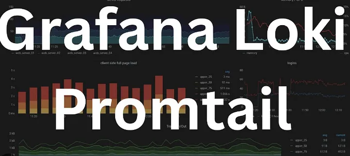

# Grafana, Loki, and Promtail for Visualization on AWS EC2 Instance



## Observability:

In DevOps, observability is referred to the software tools and methodologies that help Dev and ops teams to log, collect, correlate, and analyze a massive amounts of performance data from distributed application and real-time insights. observability is a crucial for maintaining the reliability and availability of software systems. It can be divided into three main components:

1; Monitor
2; logs
3; Alerts

### What is Grafana ?

URL — https://grafana.com/

Grafana was built on the principle that data should be accessible to everyone in organization, not just to the Ops team.

Grafana helps to facilitate a culture where data can be easily be used and accessed by the people that need it.

With Grafana, you can take any of your existing data- be it from your Kubernetes cluster, raspberry pi, different cloud services, or even Google Sheets- and visualize it however you want, all from a single dashboard.
In this project, we will be monitoring a sample application and visualizing its logs using Grafana, Loki, and Promtail. The application is a simple web server that generates logs for each request it receives.

### Grafana Loki

Loki is a horizontally scalable, highly available, multi-tenant log aggregation solution. It’s designed to be both affordable and simple to use. Rather than indexing the contents of the logs, it uses a set of labels for each log stream. Promtail is an agent that ships the logs from the application to Loki. In Simple words, Loki acts as a data source and provides logs to Grafana whereas Promtail captures logs from various sources.

### Loki vs Prometheus

Loki and Prometheus are both open source tools. While Loki is a log aggregation tool, Prometheus is a metrics monitoring tool. Loki’s design is inspired by Prometheus but for logs.

Project Details
Step 1 — Launch an AWS EC2 T2 Micro Instance and install nginx

Step 2— Install and start Grafana

Step 3— Install Docker

Step 4— Create a directory for Grafana configs

Step 5— Download Loki and Promtail configs

Step 6— Run Loki, enable Port 3100 and test Loki

Step 7— Run Promtail

Step 8— Link Loki to Grafana

Step 9— Explore and filter logs

Step 10 — Show Grafana logs

Step 11 — Restart Promtail

Step 12 — Show nginx data visuals

Step 13 — References and GitHub Repository

Now, lets get started and dig deeper into each of these steps :-

Step 1 — Launch an AWS EC2 T2 Micro Instance. Choose an existing or create a new key pair. Enable HTTP and HTTPS Settings. Once the instance is in running state, connect via SSH.

Once you are connected, let us first update the system and install nginx

```
sudo yum update
sudo yum install nginx

Step 2 — Install and start Grafana

sudo yum update
sudo nano /etc/yum.repos.d/grafana.repo

Add this to thi file:
[grafana]
name=grafana
baseurl=https://rpm.grafana.com
repo_gpgcheck=1
enabled=1
gpgcheck=1
gpgkey=https://rpm.grafana.com/gpg.key
sslverify=1
sslcacert=/etc/pki/tls/certs/ca-bundle.crt

To prevent beta versions from being installed, add the following exclude line to your .repo file.

exclude=*beta*

To install Grafana OSS, run the following command:
sudo yum install grafana

To start the service, run the following commands:

sudo systemctl daemon-reload
sudo systemctl start grafana-server
sudo systemctl status grafana-server

To verify that the service is running, run the following command:

sudo systemctl status grafana-server
Configure the Grafana server to start at boot using systemd
To configure the Grafana server to start at boot, run the following command:

sudo systemctl enable grafana-server.service
```

Step 3 — Install Docker (We will be installing Loki and Promtail through Docker and hence we will first add Docker here)

```
sudo yum update
sudo yum install docker -y
sudo systemctl enable docker.service
sudo systemctl start docker.service
```

Step 4 — Create a directory for Grafana configs (We will keep the configuration files for Loki and Promtail in this folder)

```
sudo mkdir grafana_configs
cd grafana_configs
```

Step 5 — Download Loki and Promtail configs
```
### Download Loki Config

sudo wget https://raw.githubusercontent.com/grafana/loki/v2.8.0/cmd/loki/loki-local-config.yaml -O loki-config.yaml

###  Download Promtail Config
sudo wget https://raw.githubusercontent.com/grafana/loki/v2.8.0/clients/cmd/promtail/promtail-docker-config.yaml -O promtail-config.yaml

 ls
loki-config.yaml  promtail-config.yaml

```

Step 6 — Run Loki, enable Port 3100 and test Loki

```
docker run -d --name loki -v $(pwd):/mnt/config -p 3100:3100 grafana/loki:2.8.0 --config.file=/mnt/config/loki-config.yaml

Unable to find image 'grafana/loki:2.8.0' locally
2.8.0: Pulling from grafana/loki
ef5531b6e74e: Pull complete 
fc391c13292d: Pull complete 
d11d7723d072: Pull complete 
6ece594cf4ef: Pull complete 
97b581081b3e: Pull complete 
e52f72e1a71a: Pull complete 
Digest: sha256:0d28e4dddd4ccce1772544a501e8b8f96595accbb74ee8cd0415bce81dd2edfc
Status: Downloaded newer image for grafana/loki:2.8.0

```

Since Loki runs on Port 3100, enable Port 3100 and test Loki

Now, when you do docker ps you will see grafana loki container
Test Loki by accessing: http://your-ec2-instance-ip:3100/metrics
Also, you can check the status using http://your-ec2-instance-ip:3100/ready
